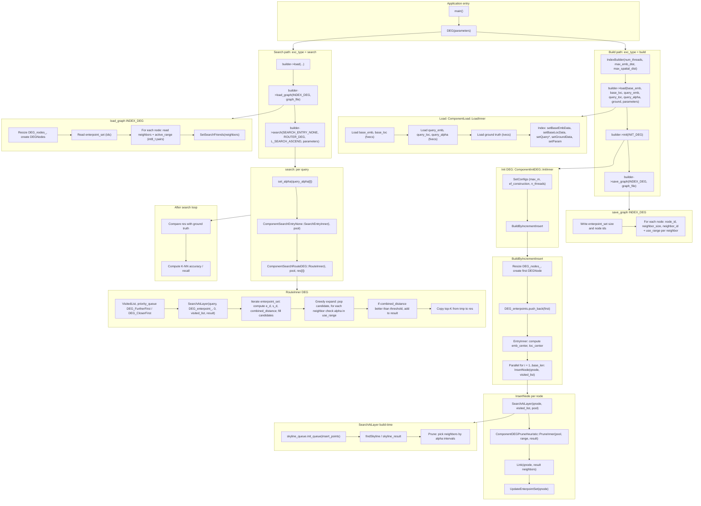

# DEG Usage Path

This document describes the full usage path for the Dynamic Edge navigation Graph (DEG) index: from application entry point through build and search.

## Full DEG usage path (figure)

## Summary

| Phase | Key components |
|-------|----------------|
| **Entry** | `main()` → `DEG(parameters)` (test/main.cpp). |
| **Load** | `ComponentLoad::LoadInner`: base/query emb & loc (fvecs), query_alpha, ground (ivecs) → Index. |
| **Build** | `ComponentInitDEG::InitInner` → `SetConfigs`, `BuildByIncrementInsert` → `EntryInner`, `InsertNode` (parallel), `SearchAtLayer` (skyline_queue, findSkyline), `ComponentDEGPruneHeuristic::PruneInner`, `Link`, `UpdateEnterpointSet`. |
| **Save** | `save_graph(INDEX_DEG)`: enterpoint set, then per-node neighbors with alpha `use_range`. |
| **Load graph** | `load_graph(INDEX_DEG)`: restore DEG_nodes_, enterpoint_set, neighbors + active_range. |
| **Search** | For each query: `set_alpha` → `SearchEntryInner` (NONE = empty pool) → `ComponentSearchRouteDEG::RouteInner` → `SearchAtLayer` over enterpoint_set, greedy expansion with alpha-in-range check → top-K to res. Recall vs ground truth. |

## Data flow (two vectors)

- **Embedding**: `base_emb_data_`, `query_emb_data_`; distance via `E_Distance`.
- **Spatial**: `base_loc_data_`, `query_loc_data_`; distance via `S_Distance` (2D).
- **Combined**: `alpha * e_d + (1 - alpha) * s_d` via `stkq::combined_distance(index, e_d, s_d)` (or per-query weight).
- **DEG graph**: Each node stores neighbors with an **available_range** (alpha intervals) for when the edge is useful; search uses **active_range** (int8_t) for alpha-in-range pruning during route.
